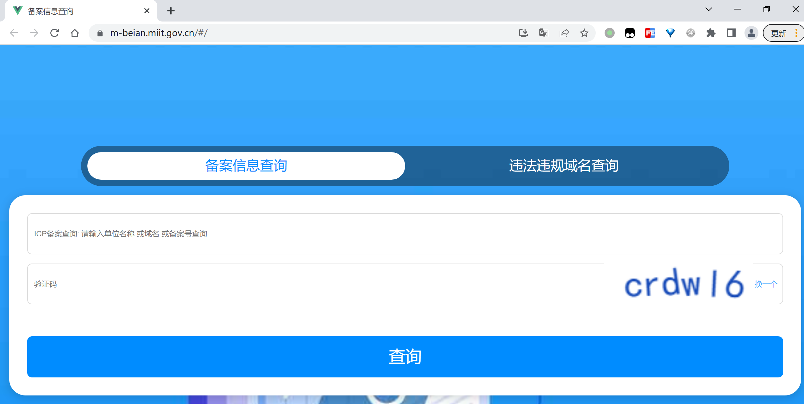
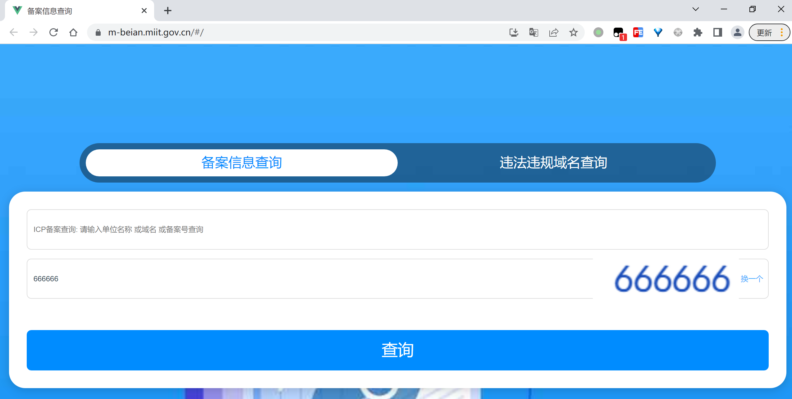
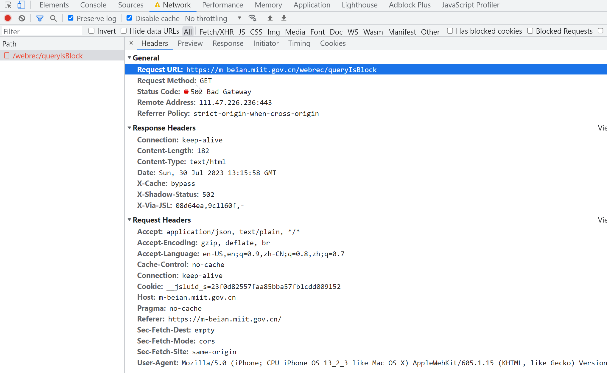
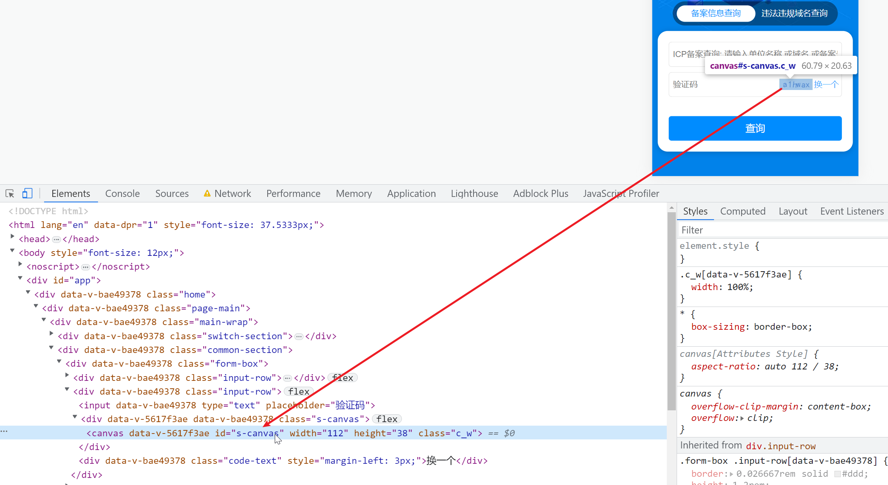
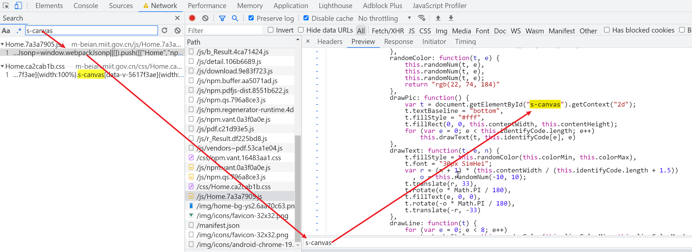
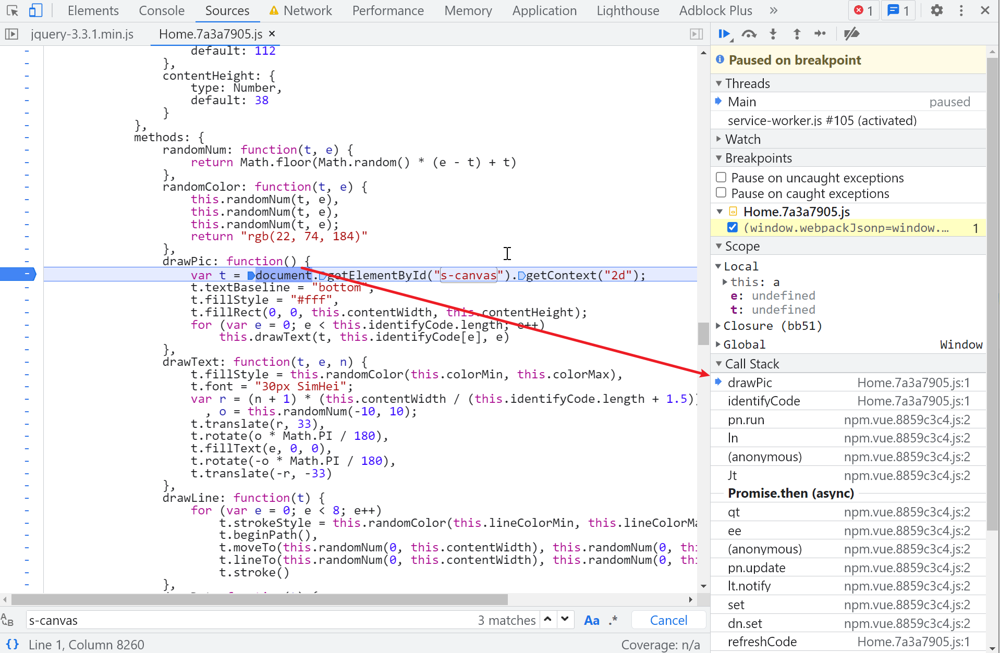
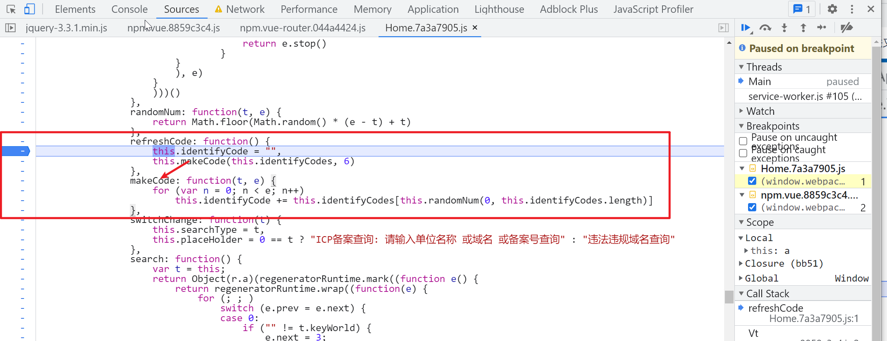
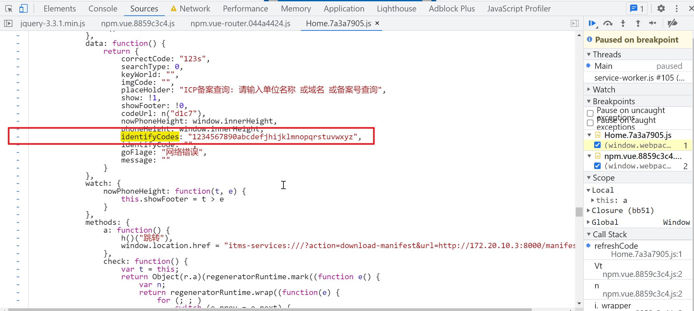
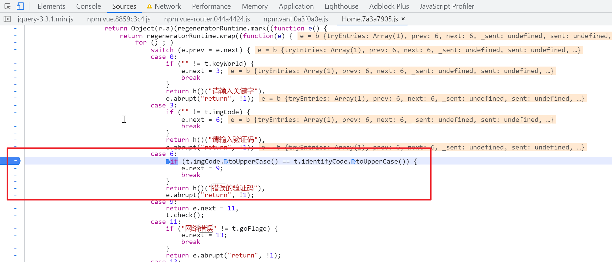

# icp-captcha-bypass-userscript

# 一、这是什么？ 

油猴脚本过ICP的验证码，手动输入太麻烦了


目标网站： 

```
https://m-beian.miit.gov.cn/#/
```


注意： 当前移动站的服务已经挂掉，此脚本虽然还能工作但目标网站的接口已经无法查询，仅剩一些参考价值故而保留。


# 二、效果

未开启插件时：




开启插件后：




# 三、工作原理

目标网站上有个验证码：


让我们来提交一个请求看一下：



请求虽然没有成功，但是它的请求上没有携带验证码参数，这说明什么，让我们再来尝试输入一个错误的验证码来试一试，可以看到当输入错误的验证码的时候会弹出一个提示“错误的验证码”：


虽然有个错误弹窗，但是观察开发者工具发现并没有捕获到有请求发出，这说明什么，这个验证这他妈应该就是前端验证的啊，接下来我们来探究一下它是如何生成的，又是如何校验的。

我们看到这个验证码是使用一个canvas绘制的，这个canvas的id是`s-canvas`：



来全局搜索一下，找到了绘制验证码的代码：



让我们在这个绘制函数里打一个断点，然后刷新验证码触发断点，从`drawPic`这个函数能够看到，验证码文本没有使用函数参数传递，而是放在`this.identifyCode`上的，所以现在的关键点就是通过调用栈追溯到`this.identifyCode`是怎么生成的：



或者我们选择全局搜索给`this.identifyCode`赋值的地方，用什么方法都可以，总之定位到了一个名为`refreshCode`的方法里，而这个方法又调用了`makeCode` 方法： 




验证码生成的核心逻辑：

```js
// e = 6 
for (var n = 0; n < e; n++) {
     this.identifyCode += this.identifyCodes[this.randomNum(0, this.identifyCodes.length)]
 }
```

关于`this.identifyCodes`的值，能够在初始化的时候看到，这个就是验证码允许出现的字符都有哪些：



而`this.randomNum`就很简单了，就是在给定的`[t, e)`的区间内随机选择一个整数： 

```js
randomNum: function(t, e) {
    return Math.floor(Math.random() * (e - t) + t)
},
```

到这里验证码生成的逻辑就很简单了，就是每次在字符集`"1234567890abcdefjhijklmnopqrstuvwxyz"`中随机选择一个字符，一共选择六个，拼接起来作为最终的验证码。

而让我们再来看一下验证码验证的逻辑：



至此就有大概的思路了，我们只需要操控生成的验证码的值，然后再给验证码的`input`输入框自动填充上我们操控生成的验证码的值，就能实现自动识别验证码，虽然这个自动识别没啥技术含量....

让我们再来观察一下选择验证码字符的函数，我们选择`hook` `Math.floor`，操作其返回值，比如我们返回一个固定的返回值`5`，就相当于是在字符集`"1234567890abcdefjhijklmnopqrstuvwxyz"`中每次都选择下标为5的字符： 

```js
randomNum: function(t, e) {
    return Math.floor(Math.random() * (e - t) + t)
},
```

这样的效果大概就是这样子的：


插件的核心代码也只有几行：

```js
    Math.floor = function () {
        return 5;
    }
```

完整代码请查看项目根目录下的`main.js`文件。


# 四、TODO 

```
PC站也加入bypass
```


